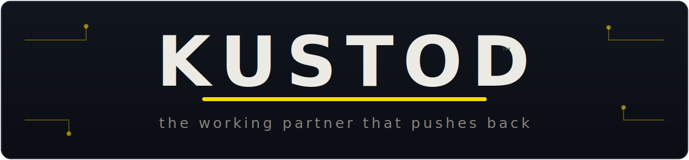

  

# 🔨 KUSTOD

### Stop shipping AI that agrees with you. Ship a working partner that pushes back — and remembers why.

**A 10-minute setup that turns any AI chat tool into a consistent working partner.**
No install · no login · no platform · works in ChatGPT · Claude · Copilot · Gemini.

---

Everyone is shipping "an AI agent that learns and remembers." Hermes, RSI startups, every other thread. They're all missing one thing.

**An agent that remembers *and agrees with you* isn't a partner. It's a yes-man with memory.** The single most expensive thing an AI can do is confidently agree with you while you're wrong.

A **KUSTOD** is the opposite: a working partner configured around your role, your style, your memory habits — and one rule most AI quietly breaks:

> **It tells you when you're wrong.**

---

## What is a KUSTOD?

Not an agent. Not a chatbot. A **working partner** built on four things:

1. **Your role & goals** — so it stops giving generic answers
2. **Your working style** — concise vs deep, direct vs gentle
3. **A memory habit** — so you stop re-explaining yourself every session
4. **A correction loop** — so it challenges weak ideas instead of flattering you

The value isn't magic. It's **consistency over time + the willingness to push back.**

---

## ⚡ Quick start (10 minutes)

1. Open a fresh chat in your AI tool of choice.
2. Copy the activation prompt from **[KUSTOD-STARTER-PACK.md](KUSTOD-STARTER-PACK.md)**, fill in the brackets, paste it.
3. Get one useful thing out of it today.

That's it. Re-paste at the start of new threads until your tool's memory holds it.

---

## 📦 What's inside

| File | What |
|------|------|
| **[KUSTOD-STARTER-PACK.md](KUSTOD-STARTER-PACK.md)** | The full pack — 8 activation blocks, copy-paste prompt, 7-day test, measurement sheet |
| **[kustods/business-kustod.md](kustods/business-kustod.md)** | 💼 Ready-made for sales / BDM / founders |
| **[kustods/security-kustod.md](kustods/security-kustod.md)** | 🛡️ Ready-made for cyber / SOC / presales |
| **[kustods/everyday-kustod.md](kustods/everyday-kustod.md)** | 🧓 Ready-made for non-technical life |
| **[FEEDBACK.md](FEEDBACK.md)** | Tried it? Tell me the one thing that confused you. |

---

## 📊 The one metric that matters

**A useful artifact within 24 hours.** If a KUSTOD gets you from zero to one useful result in a day, it works. Measure artifacts, not feelings.

---

## The line

> **Don't ship AI that agrees. Ship a working partner that pushes back — and remembers why.**

---

*KUSTOD Starter Pack · v0.1 · free · MIT licensed · feedback wanted.*
*Built by [Ondřej Šrámek](https://www.linkedin.com/). Try it, then tell me what broke.* 🔨
